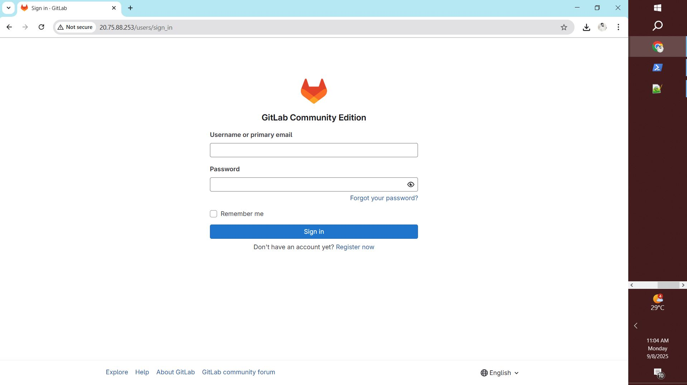
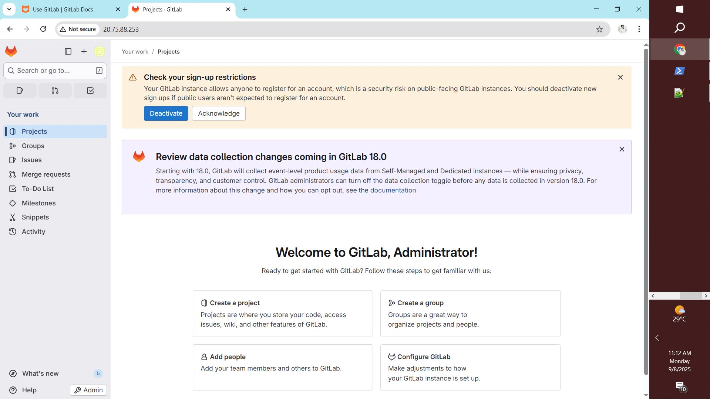
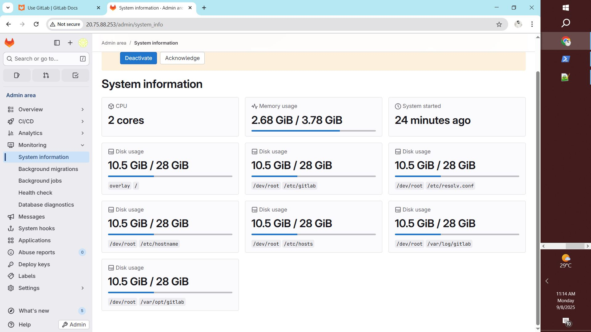
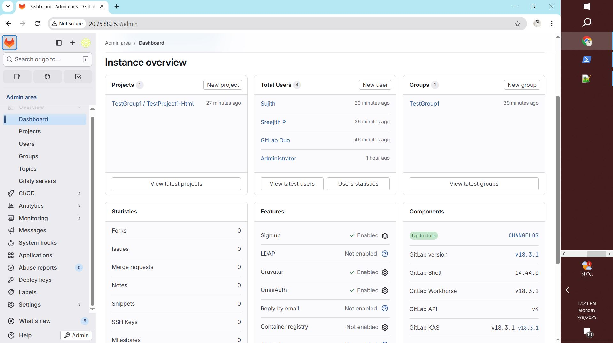
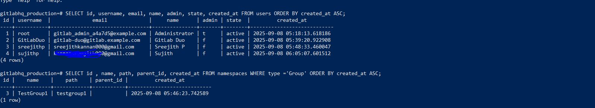
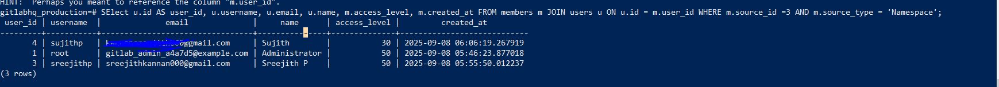

# 🚀 GitLab CE Setup with Docker Compose

This repository provides a simple setup for running [GitLab Community Edition](https://about.gitlab.com/install/) using Docker Compose.

---

## 📦 Setup Instructions

1. **Clone this repository:**
   ```sh
   git clone https://github.com/yourusername/gitlabsetup.git
   cd gitlabsetup
   ```

2. **Review and customize `docker-compose.yml`:**
   - The file configures GitLab CE with persistent volumes for configuration, logs, and data.
   - Default ports: `80` (HTTP), `443` (HTTPS), `22` (SSH).

3. **Start GitLab:**
   ```sh
   docker-compose up -d
   ```

4. **Access GitLab:**
   - Open your browser and go to [http://gitlab.example.com](http://gitlab.example.com)
   - Replace `gitlab.example.com` with your server's IP or configured hostname.

---

## 🖼️ Screenshots

### **Sign-in Page**


### **Homepage**


### **GitLab Admin System Info**


### **Admin Login Screenshot**


---

## ⚙️ Useful PostgreSQL Queries

Below are some handy SQL queries for managing users and namespaces in your GitLab instance.

### 🔹 Query 1 – All User Details and Namespace Members List

```sql
SELECT u.id AS user_id, u.username, u.email, u.name, m.access_level, m.created_at
FROM members m
JOIN users u ON u.id = m.user_id
WHERE m.source_id = 3 AND m.source_type = 'Namespace';
```

**Screenshot:**  


---

### 🔹 Query 2 – All User Details

```sql
SELECT id, username, email, name, admin, state, created_at
FROM users
ORDER BY created_at ASC;
```

---

### 🔹 Query 3 – All User Details of a Specific Group

```sql
SELECT u.id AS user_id, u.username, u.email, u.name, m.access_level, m.created_at
FROM members m
JOIN users u ON u.id = m.user_id
WHERE m.source_id = 3 AND m.source_type = 'Namespace';
```

**Screenshot:**  


---

## 📝 Notes

- Make sure Docker and Docker Compose are installed on your system.
- Update the `external_url` and hostname in `docker-compose.yml` as needed.
- For advanced configuration, refer to the [GitLab Docker documentation](https://docs.gitlab.com/ee/install/docker.html).

